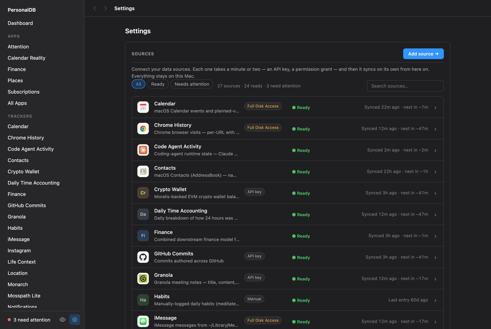
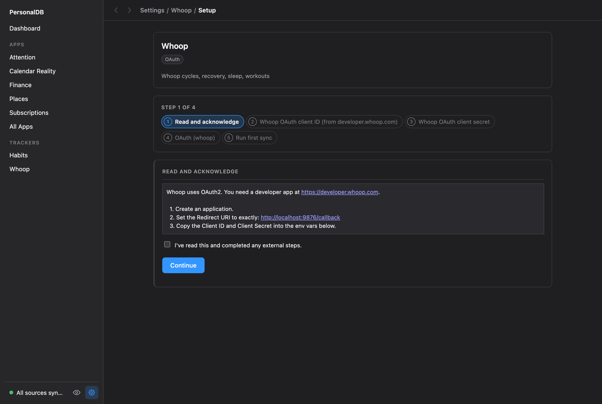
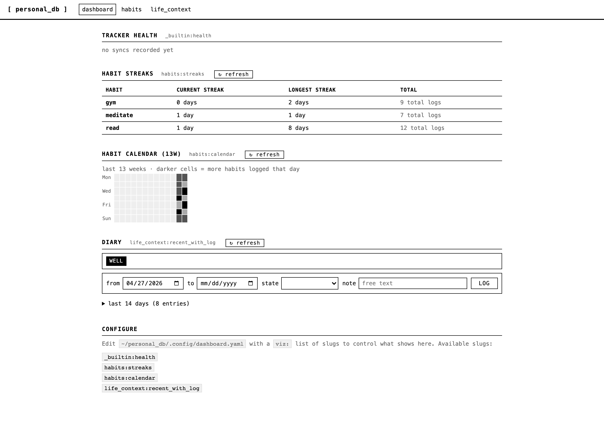

# personal_db

The missing open-source database + data-sync piece for self-hosted agentic second-brain systems.

Where Obsidian holds your notes, `personal_db` holds your structured data — sleep, code, messages, screen time, contacts, calendar — in a local SQLite file, and exposes it to AI agents over MCP so they have persistent memory of you across tools (Claude Desktop, Claude Code, OpenClaw, Cursor, …).

SQLite + per-tracker ingest scripts + MCP server. macOS only in v0.

## Install

### The app (recommended)

[**Download PersonalDB.dmg**](https://github.com/intelc/personal-db/releases/latest/download/PersonalDB_aarch64.dmg) (signed + notarized, Apple Silicon) — or browse [all releases](https://github.com/intelc/personal-db/releases).

It's a menu-bar app that runs everything: the dashboard in a native window, background sync (no launchd setup needed — the app manages its own daemon), and one-click "Connect AI Apps" for Claude Code / Claude Desktop / Cursor. It updates itself (a quiet check shortly after launch, plus "Check for Updates…" in the tray), and an update cleanly replaces the running background daemon — no manual restarts.

The app being signed is not cosmetic: macOS grants Full Disk Access to a *binary identity*, so the FDA prompt says "PersonalDB" instead of "Python", and the grant survives every update. With the CLI install, a `brew upgrade python` can silently revoke it.

### CLI install

```bash
bash <(curl -LsSf https://raw.githubusercontent.com/intelc/personal-db/main/install.sh)
```


This installs [`uv`](https://github.com/astral-sh/uv) if you don't have it, then `uv tool install`s `personal-db` and launches the setup wizard.

The wizard initializes the data root, then asks how you want to configure trackers — **Browser** (visual wizard at http://127.0.0.1:8765/setup), **Terminal** (questionary prompts), or **Skip**.

**Why `bash <(...)` instead of `curl ... | bash`?** Process substitution keeps your terminal connected as stdin, so the interactive wizard launches automatically after install. The `curl | bash` form pipes the script *into* bash's stdin, which means there's no TTY left for an interactive prompt. Both forms install the binary correctly; only the first auto-launches the wizard.

**Non-interactive install** (CI, headless servers — wizard skipped):

```bash
curl -LsSf https://raw.githubusercontent.com/intelc/personal-db/main/install.sh | bash
# then run `personal-db setup` whenever you're ready
```

`PERSONAL_DB_NO_SETUP=1` also opts out of the wizard if you piped via `bash <(...)` and want install-only.

### From source (for development)

```bash
git clone https://github.com/intelc/personal-db
cd personal-db
./scripts/install_dev.sh
source .venv/bin/activate
```

## How the app is built

The native app is a Tauri menu-bar shell ([`shell/`](shell/README.md)) around a frozen,
code-signed Python daemon — same architecture as Screenpipe's shell + sidecar. The
freeze/sign/notarize/DMG/release pipeline lives in [`packaging/`](packaging/README.md)
and runs as one command (`packaging/release.sh`). The CLI install and the app share
the same data root, daemon, and web UI — the app is a managed way to run them.

## Quick start

**Using the app?** There's nothing to run — first launch opens the dashboard, and Settings → "Add source" starts the same guided setup shown below. The rest of this section is the CLI path.

`personal-db setup` is the only command you need to run after a CLI install. It walks through tracker selection, configuration, daemon install, and agent wire-up in one flow.

```bash
personal-db setup
```


You'll be asked which mode you want:

- **Browser** (recommended) — opens Settings at `http://127.0.0.1:8765/setup`: a searchable sources list (status, last sync, what each connection needs), and a guided step-by-step wizard per source — external steps like creating an OAuth app come with clickable links and a copy button for the exact redirect URI, and setup ends with a verified first sync.
- **Terminal** — questionary-driven prompts in your shell.
- **Skip** — exits cleanly; run `personal-db setup` again whenever you're ready.





After you finish configuring trackers, finalize steps run automatically:

1. **Daemon** — installs a launchd agent (`~/Library/LaunchAgents/com.personal_db.daemon.plist`) that keeps a long-running `personal-db dev daemon run` process alive. (With the native app, skip this — the app spawns and manages the daemon itself.) The daemon is the single writer-of-record: it serves the local HTTP API + dashboard (every route but health requires a token, see below), and an in-process scheduler thread runs `sync_due` (and any declared per-tracker/app background jobs) on their own cadences — there's no separate scheduler process anymore. A source that keeps failing backs off (30m → 2h → 8h) and then **pauses** instead of retrying forever; it shows as Paused in Settings, and fixing it there (or any manual sync that succeeds) resumes it. If a command ever prints `personal-db daemon not running`, the fix is `personal-db daemon install`; `personal-db status` gives a one-screen readout of daemon/tracker/FDA/MCP state.
2. **MCP server** — auto-installs `personal_db` into the agents you choose (Claude Code, Claude Desktop, Cursor). Behind the scenes this calls `claude mcp add` (Code), or merges into `~/Library/Application Support/Claude/claude_desktop_config.json` (Desktop), or `~/.cursor/mcp.json` (Cursor).
3. **Dashboard** (optional) — offers to launch the menu bar + dashboard via `personal-db ui`. Default is skip; agents read your data over MCP regardless of the dashboard being open.

### After setup

```bash
# Pull historical data once (the daemon's scheduler only handles incremental sync going forward)
personal-db backfill github_commits
personal-db backfill whoop

# Install the /insights skill into Claude Code (one-time)
mkdir -p ~/.claude/skills/personal-db
cp src/personal_db/templates/claude_skill/insights.md ~/.claude/skills/personal-db/

# Open the dashboard whenever you want
personal-db ui

# Add MCP into another agent later
personal-db mcp install              # interactive picker
personal-db mcp install cursor       # non-interactive single target

# See what apps are installed / available to install
personal-db app list
personal-db app available
```

The dashboard is read **and** write, not just a viewer: bundled apps like `finance` (categorize transactions, manage recurring/burn-rate buckets), `places` (label frequent locations, manage privacy settings), `subscriptions`, `attention`, and `calendar_reality` all expose actions alongside their views — every write still goes through the daemon, which is the single writer-of-record for `db.sqlite`. `personal-db app list|available|install|reinstall` manages which apps are installed, the same way `personal-db tracker ...` manages trackers. Agents read the same data over MCP whether or not the dashboard is open.

An experimental in-browser agent terminal also lives in the daemon (spawn a `claude`/`codex` session from the dashboard). It's off by default — set `agent_terminal.enabled: true` in `config.yaml` to turn it on, and `agent_terminal.auto_approve: true` if you also want it to spawn with the CLI's permission-bypass flag rather than its normal interactive approval prompts. The daemon's HTTP API (including the agent terminal) requires a token — `GET /api/health` is the only exception — which the CLI/MCP client read automatically from `<root>/state/daemon.token`; a browser session authenticates via the `/auth` page or a one-time-code bootstrap from a launcher that already holds the token (see `services/daemon/routes/auth.py`). Trackers must also pass validation (`personal-db tracker validate <name>`, automatic for bundled templates) before `sync`/`backfill` will run them.



### Re-running setup

`personal-db setup` is idempotent. Run it any time to add a new tracker, rotate a credential, or re-enable the daemon. Existing values are shown as defaults (secrets masked) so you can press Enter to keep them.

## CLI argument order note

`--root` is a *global* option on the `personal-db` parent command. It must appear **before** the subcommand:
- ✅ `personal-db --root /tmp/foo init`
- ❌ `personal-db init --root /tmp/foo` (rejected by typer)

Without `--root`, the data root defaults to `~/personal_db`.

## Credentials

Credentials live in `<root>/.env` (default `~/personal_db/.env`, mode 0600).
The file is loaded automatically on every `personal-db` invocation; shell
environment variables override `.env` values (useful for debugging and tests).

To rotate a credential, re-run `personal-db setup` and reconfigure the
relevant tracker — current values are shown as defaults (secrets are masked).
Or jump straight to a single tracker via `personal-db tracker setup <name>`.

## Verify

In Claude Code:
- "What trackers do I have?" → calls `list_trackers`
- "How many commits did I push last week?" → calls `query` or `get_series` against `github_commits`
- "Log that I meditated today" → calls `log_event("habits", …)`
- "/insights weekly review" → runs the skill, writes `notes/YYYY-MM-DD-weekly-review.md`

## Creating your own tracker

`personal-db` ships with a starter set of trackers (GitHub, Whoop, Screen Time, iMessage, …), but the most useful data is usually idiosyncratic to you. Three ways to add a new one:

1. **Ask Claude.** Once MCP is wired up, ask Claude to use the `create_tracker` prompt — it walks through the design Q&A and writes all four files. Fastest path.
2. **`personal-db dev tracker new <name>`** scaffolds a stub at `~/personal_db/trackers/<name>/`.
3. **Copy a bundled tracker** under `src/personal_db/templates/trackers/` and adapt.

A tracker is just four files: `manifest.yaml`, `schema.sql`, `ingest.py`, and an optional `visualizations.py`. Full guide with a worked example: **[docs/creating-trackers.md](docs/creating-trackers.md)**.

## Custom pack dependencies

The signed native app ships a sealed, embedded Python interpreter — nothing can be added to its own `site-packages` without breaking the code signature. If your custom tracker/app's `ingest.py` (or `views.py`/`actions.py`) needs a third-party package the bundle doesn't ship, declare it in the manifest:

```yaml
# manifest.yaml (tracker) or app.yaml (app)
python_deps:
  - requests>=2.31
  - some-niche-package==1.2.3
```

Then install it:

```bash
personal-db tracker deps <name>     # or: personal-db app deps <name>
personal-db tracker deps --all      # every installed tracker
```

This runs `pip install --target <root>/lib` — a plain directory the CLI, daemon, and MCP server all add to `sys.path` at startup (after the bundle's own packages, so a pack can never shadow one of the engine's own dependencies). Re-run `tracker deps` after changing `python_deps`; editing `manifest.yaml` also invalidates the tracker's validation stamp, so `sync`/`backfill` will ask for `tracker validate` again first. If a sync fails with `ModuleNotFoundError` for a tracker that declares `python_deps`, the error message includes a `personal-db tracker deps <name>` hint.

## Layout

See `docs/creating-trackers.md` for the tracker-authoring guide.
See `docs/superpowers/specs/2026-04-25-personal-db-v0-design.md` for the full design.
See `docs/superpowers/plans/2026-04-25-personal-db-v0.md` for the implementation plan.
