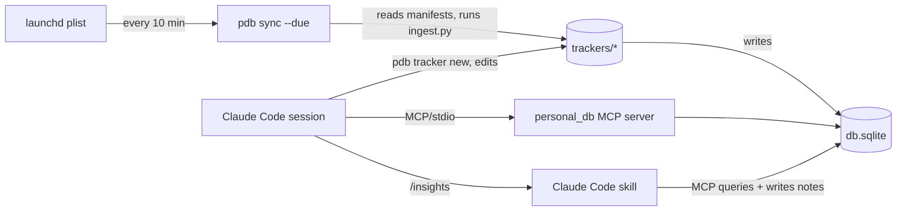

# personal_db v0 — Design

**Status:** Draft for review
**Date:** 2026-04-25

---

## 1. Problem

Mosspath proved that a feature-rich ambient AI is operationally heavy: a Swift macOS app, a Node sidecar, system-wide capture, computer-use, dashboards, an opinionated event store. Most of that weight serves capture and inference orchestration, not data.

Meanwhile the *quantified-self* and *personal-data-warehouse* spaces have well-known prior art (Datasette/dogsheep, HPI, Exist.io, Bearable) that have failed to cross the chasm for two reasons: (a) cold-start data problem, and (b) integration treadmill. The technical novelty of "SQLite + scripts + dashboards" is roughly zero in 2026.

What changed in 2026 that makes a *new* attempt worthwhile:

1. **LLMs invert the integration treadmill.** "Connect Whoop" → agent writes the ingest script; rewrites it when the API breaks.
2. **MCP is a real distribution surface.** A personal DB whose data automatically appears in Claude / Cursor / ChatGPT is categorically different from a personal DB you log into to view dashboards.
3. **Filesystem-as-protocol + LLMs makes agentic self-modification credible.** Trackers as conventionally-named files in a folder is the right shape for an LLM to safely modify in production.

## 2. Wedge

**Primary wedge (B):** *Personal data layer for AI agents you already use.* The MCP server is the headline product. Insights happen contextually, in the conversations you're already having, not in a dashboard you forget to open.

**Secondary (A):** *Quantified-self playground.* The same data, surfaced as on-demand reports/charts that Claude renders inline. This is where you experiment, iterate on what's worth tracking, and develop intuition. It does **not** ship as a separate UI in v0.

We are explicitly **not** building: a consumer dashboard app, a SaaS, a notification engine, a habit-tracking UI. Those are downstream of "do we like the data layer."

## 3. Architecture (v0)

**Single-process, no daemon.** Every component runs as a CLI invocation or an MCP request, fired by either:
- the user's Claude Code session (MCP), or
- macOS launchd (scheduled CLI).



There is no long-running personal_db process. The MCP server is spawned on demand by Claude Code (per MCP convention). The "scheduler" is one launchd entry calling a CLI.

**Why:** v0's job is to test whether the data layer + MCP surface is useful. A daemon adds infrastructure that doesn't help answer that question. v0.1 will introduce a thin daemon (option 3 from brainstorming) once seams in this model become painful.

## 4. On-disk layout

User-configurable root, default `~/personal_db/`:

```
~/personal_db/
  config.yaml                # MCP server config, scheduler config, root paths
  db.sqlite                  # the one source of truth for data
  trackers/
    <name>/
      manifest.yaml          # name, description, schema, time_column,
                             #   granularity, related_entities,
                             #   permission_type, setup_steps, schedule
      schema.sql             # CREATE TABLE … for this tracker's tables
      ingest.py              # backfill + sync entry points (uses framework)
      views/                 # optional SQL views (daily/weekly rollups)
  entities/
    people.yaml              # canonical people + aliases (mirrored to db on sync)
    topics.yaml              # canonical topics + aliases
  notes/                     # markdown files Claude writes (insights, reports)
                             #   indexed in db for retrieval via MCP
  state/
    cursors.sqlite           # per-tracker incremental sync cursors
    last_run.json            # last successful sync timestamps per tracker
    oauth/                   # encrypted OAuth tokens (mode 0600)
```

**Justification for files-not-just-DB on entities/notes:** an agent edits files; OS tools work on files; git versioning is free. Both are also mirrored into the SQLite db so MCP queries don't need to traverse YAML.

## 5. Storage model

**Each tracker fully owns its tables.** No canonical `metrics` / `events` super-table. Connectors define DDL in `schema.sql` and write whatever shape fits the source.

**Conventions enforced by manifest validation:**

- Every tracker MUST declare a `time_column` (which column carries the timestamp, and its semantics — event time / period start / ingestion time).
- Every tracker MUST declare each column's type and a one-line semantic description in the manifest's `schema:` section. This is what the MCP server hands to the agent; column comments alone aren't enough.
- Tables that reference people/topics MUST use `*_id` foreign keys to the canonical `people`/`topics` tables (not free-text strings) when the dimension is meaningful for cross-tracker correlation.

**Aggregation is user/SQL-defined.** Trackers can ship views in `views/` for common rollups (daily, weekly). The MCP `get_series` helper accepts an optional `granularity` arg; if a matching view exists it uses that, otherwise it falls back to runtime `GROUP BY` on the time column.

### 5.1 Entity registry (minimal)

Two canonical tables, populated from `entities/people.yaml` and `entities/topics.yaml` on each sync:

```sql
CREATE TABLE people (
  person_id   INTEGER PRIMARY KEY,
  display_name TEXT NOT NULL,
  created_at  TEXT NOT NULL
);
CREATE TABLE people_aliases (
  alias       TEXT PRIMARY KEY,   -- e.g. "Marko Chen", "marko@…", phone, handle
  person_id   INTEGER NOT NULL REFERENCES people(person_id)
);
-- topics analogous
```

The framework provides `resolve_person(alias) -> person_id`. If no match, behavior depends on `--strict-entities`:
- default: auto-create a new person with `display_name = alias`, log to a "needs review" file
- strict: raise; ingest fails until alias is registered

YAML files are the source of truth for human-edited data; the SQLite mirror is rebuilt from YAML at sync time so an agent or human can edit either and they reconcile.

## 6. Connector contract

A tracker is a folder under `trackers/<name>/` with the structure in §4. The Python ingest contract:

```python
from personal_db import tracker

def backfill(t: tracker.Tracker, start: str | None, end: str | None) -> None:
    """One-shot historical import. Idempotent. Safe to re-run."""
    ...

def sync(t: tracker.Tracker) -> None:
    """Incremental sync from cursor. Idempotent."""
    cursor = t.cursor.get(default="2020-01-01")
    rows = fetch_from_source(since=cursor)
    t.upsert("github_commits", rows, key=["sha"])
    if rows:
        t.cursor.set(max(r["committed_at"] for r in rows))
```

The `Tracker` API exposes:

- `t.cursor.get(default=...) / t.cursor.set(value)` — per-tracker cursor in `state/cursors.sqlite`
- `t.upsert(table, rows, key=[…])` — idempotent insert/update
- `t.resolve_person(alias) / t.resolve_topic(alias)` — entity resolution
- `t.config` — read manifest fields (e.g. API base URL, OAuth token)
- `t.log` — structured logger

**SQL escape hatch:** because tables are plain SQLite, anything that can write to SQLite is a valid connector — shell pipes, iOS Shortcuts via `sqlite3` CLI, manual `INSERT` from a notebook. The Python framework is the *canonical* path and what the agent generates by default, but it's not the *only* path.

## 7. CLI: `pdb`

```
pdb init                               # create root dir + config + entities skeleton
pdb tracker new <name>                 # scaffold a tracker (manifest + schema + ingest)
pdb tracker list                       # show registered trackers + last sync
pdb tracker setup <name>               # walk through manifest's setup_steps
                                       #   (OAuth flow, FDA prompt, API key entry, etc.)
pdb sync [--due | <name>]              # run sync for due trackers or a specific one
pdb backfill <name> --from <date>      # historical import
pdb log <tracker> <key=val…>           # manual entry fallback (writes via same path
                                       #   as MCP log_event tool)
pdb permission check <name>            # probe whether required OS permission is granted
pdb scheduler install                  # write launchd plist that fires `sync --due`
pdb scheduler uninstall
pdb scheduler status
pdb mcp                                # run the MCP server (called by Claude Code)
```

`pdb sync --due` reads each tracker's manifest `schedule:` field (`every: 1h` or cron string), checks `state/last_run.json`, runs the overdue ones, exits.

## 8. MCP server

**Transport:** stdio (the standard for Claude Code). One MCP server process per Claude Code session, spawned via `pdb mcp`.

**Tools exposed:**

| Tool | Purpose |
|---|---|
| `list_trackers()` | Returns name + one-line description for each registered tracker. |
| `describe_tracker(name)` | Returns the full manifest (schema, semantics, time column, granularity). The agent calls this to learn what's in a tracker before querying. |
| `query(sql)` | Runs read-only SQL against `db.sqlite`. The escape hatch. |
| `get_series(tracker, range, granularity?, filters?)` | Convenience for time-series fetches. Uses a matching view if one exists, else runtime `GROUP BY`. |
| `list_entities(kind, query?)` | List people or topics, optionally filtered by name/alias substring. |
| `log_event(tracker, fields)` | The agent-mediated capture path for manual trackers (e.g. `habits`). The framework validates `fields` against the tracker's manifest schema. |
| `read_note(path) / list_notes(query?)` | Read insights/reports Claude has previously written into `notes/`. |

**Read-only by default.** `query` is enforced as `SELECT`-only. `log_event` is the only write path. We deliberately do *not* expose arbitrary `write_sql` — schema changes go through `pdb tracker new` / `pdb tracker setup`, which an agent invokes via Bash, not via an MCP tool.

## 9. Manual entry

**(ii) agent-mediated.** "Claude, log that I meditated today" → Claude calls `log_event("habits", {"name": "meditate", "value": true})` → row written. The QS playground (wedge A) lives in conversation, not in a separate quick-entry app.

**(i) CLI fallback** for quick entry without going through Claude: `pdb log habits name=meditate value=true`. Same code path as the MCP tool.

## 10. Scheduling

**(β) launchd-via-CLI.** `pdb scheduler install` writes one user-domain launchd plist that fires `pdb sync --due` every 10 minutes. Per-tracker schedules live in each manifest (`schedule: every 4h` or cron); `sync --due` is the dispatcher. The plist is written to `~/Library/LaunchAgents/com.personal_db.scheduler.plist`.

**No insight scheduling in v0.** The agent's insight prompts will need iteration; scheduling them before they're tuned generates noise. Insights are user-invoked via `/insights` (see §11).

**Cross-platform:** macOS only in v0. Linux/Windows scheduling is a v0.1 concern.

## 11. Claude Code integration

Two artifacts shipped alongside the Python package:

1. **MCP server registration snippet** in the install docs — `claude mcp add personal_db -- pdb mcp`.
2. **One slash-command skill** at `~/.claude/skills/personal-db/insights.md` (or wherever the user installs it) that runs `/insights <tracker-or-question>`. The skill prompt lists the available MCP tools, asks the agent to query relevant trackers, generate analysis, and write the result to `notes/YYYY-MM-DD-<topic>.md`.

That's the entire Claude Code surface. Tracker scaffolding (`pdb tracker new`) is a CLI; the agent invokes it via Bash. Connector authoring is "edit `ingest.py`" — the agent already does this natively.

## 12. v0 connectors

Five trackers shipped, chosen to validate three distinct setup archetypes (API key / OAuth / OS-permission) and the manual-entry path:

| Tracker | Setup | Reference in mosspath | Validates |
|---|---|---|---|
| `github_commits` | API key | — (new) | Trivial baseline; the shape Claude imitates first. |
| `whoop` | OAuth | `WhoopSource.swift` (auth flow, endpoint patterns) | OAuth helper (localhost callback, token refresh, encrypted storage). |
| `screen_time` | Full Disk Access | `ScreenTimeSource.swift` (table layout, useful columns) | FDA permission flow; reads `~/Library/Application Support/Knowledge/knowledgeC.db`. |
| `imessage` | Full Disk Access | `IMessageSource.swift` (chat.db query, version handling) | Reuses FDA pattern; **best entity-resolution demo** — message senders resolve into the `people` registry. |
| `habits` | Manual via MCP `log_event` | — (new) | Agent-mediated capture path. |

Mosspath is Swift; we're writing Python. "Reference" means we mine the working SQL queries, OAuth scopes, and version-quirk handling — not literal port. The Python implementation is fresh.

**Spike already validated** (2026-04-25, macOS 26.4.1):

- `knowledgeC.db` and `chat.db` exist at expected paths on macOS 26.
- Pre-grant access returns `authorization denied` from both `sqlite3` and Python (textbook TCC/FDA signature).
- No new entitlement is required (e.g. no `com.apple.developer.deviceactivity.screen-time` error).
- Mosspath's working Swift implementations confirm the post-grant SQLite read path; behavior should be identical from Python.

**FDA wart, documented for users:** Full Disk Access is granted to the *terminal binary* (Terminal.app, iTerm2, Cursor) or directly to the Python interpreter, not to `pdb` itself. The setup docs must make this explicit.

## 13. Out of v0 (and why)

| Excluded | Why |
|---|---|
| Visualization / dashboard UI | Claude renders inline markdown tables, ASCII sparklines, or one-off SVG/HTML on demand. We learn what's wanted before building it. |
| Long-running daemon | v0's job is to test the data-layer thesis. A daemon adds infra that doesn't answer that question. v0.1 introduces a thin daemon. |
| Auto/scheduled insight generation | Prompts need iteration first. Scheduling noise = unread notifications = dead product. |
| Connectors needing Apple frameworks (HealthKit, DeviceActivity, etc.) | Would force a Swift sidecar, blowing v0 scope. SQLite-back-door connectors (screen_time, imessage) cover the OS-permission archetype without it. |
| `gcal_events` connector | OAuth scope ceremony heavier than whoop; entity-resolution demo is more compelling via imessage. v0.1. |
| Cross-platform support | macOS-only. launchd-only. Linux/Windows is v0.1. |
| Menu bar app, installer pkg, signed binary | `pip install -e .` and a documented setup walk-through are sufficient. |
| Web UI / Datasette integration | Datasette can be pointed at `db.sqlite` post-hoc by anyone who wants it; we don't ship it. |
| Arbitrary write SQL via MCP | Schema changes route through CLI scaffolds invoked by the agent via Bash. Reduces blast radius. |

## 14. Component boundaries

Each unit has a single responsibility, communicates through a documented interface, and can be understood without reading the others' internals:

| Unit | Owns | Talks to | Does not own |
|---|---|---|---|
| `personal_db.framework` | `Tracker` API, cursor/upsert primitives, entity resolution, manifest validation | SQLite, filesystem | Connector logic, scheduling, MCP transport |
| `personal_db.cli` (`pdb`) | Command parsing, scaffolding, `sync --due` dispatcher, scheduler install | framework, launchd, OS permission probes | Connector logic, MCP transport |
| `personal_db.mcp` | MCP stdio server, tool implementations, query sandboxing | framework, SQLite (read), `log_event` write path | Anything outside MCP requests |
| `trackers/<name>/ingest.py` | Source-specific HTTP/SQLite/auth logic, normalization to its tables | framework, the source | Cursor format, schedule, table layout outside its own DDL |
| `entities/*.yaml` + sync mirror | Canonical people/topics + aliases | framework | Tracker-specific data |

Files larger than ~400 LOC are a code smell at this scale — split before merging.

## 15. Error handling

- **Connector failures are isolated.** A `sync` failure in one tracker logs to `state/sync_errors.jsonl` and does not abort other trackers in the same `sync --due` run.
- **Permission denials surface clearly.** FDA-denied opens raise `PermissionError` in framework, get caught by `pdb sync`, and produce a "run `pdb permission check <name>`" hint in the error log.
- **Schema drift in upstream sources.** Manifest validates connector output rows against declared schema before insert; mismatch → fail loudly with diff. The agent can then update the manifest + schema and re-run.
- **OAuth token expiry.** Framework auto-refreshes if a refresh token is available; if not, `pdb sync` halts that tracker and emits a re-auth instruction.
- **MCP `query` enforces SELECT-only via `EXPLAIN` parse plus a deny list (`INSERT/UPDATE/DELETE/CREATE/DROP/ATTACH/PRAGMA`).** Read-only db connection as defense-in-depth.

## 16. Testing strategy

- **Framework tests:** unit tests for cursor/upsert/entity-resolution against an in-memory SQLite.
- **Connector tests:** each connector ships a `fixtures/` dir with recorded API responses or anonymized SQLite snippets; `pytest` runs `sync()` against fixtures and asserts row shapes.
- **Manifest validation:** golden-file tests that every shipped manifest validates and that `describe_tracker` output matches an expected schema.
- **MCP integration:** spawn `pdb mcp` in a subprocess, send recorded MCP requests, assert responses.
- **No live API tests in CI.** Live tests live in `tests/live/` and are opt-in (`pytest -m live`), used during connector development.

## 17. v0 success criteria

> *"I can add a new tracker in under 5 minutes by asking Claude to write it. Ingest runs on a schedule I forget about. When I'm in Claude Code, asking 'what was I doing on April 17?' or 'do I message Marko more when work is busy?' returns real, cross-source context."*

Concretely:

1. Five connectors ingesting cleanly with backfill + incremental sync.
2. `pdb scheduler install` produces a working launchd plist that runs unattended for ≥7 days.
3. MCP server reachable from Claude Code; `list_trackers` / `describe_tracker` / `query` / `get_series` / `log_event` all work.
4. Entity resolution: at least one cross-tracker query (e.g. iMessage frequency × commit days for `person_id = $marko`) returns sensible results.
5. `/insights` slash command can produce a written analysis to `notes/` from a single user prompt.

## 18. Open questions deferred to implementation plan

- Exact launchd plist contents (`StartInterval` vs `StartCalendarInterval`; how to log).
- OAuth callback port allocation (fixed vs ephemeral).
- Mirroring mechanics for `entities/*.yaml` → SQLite. §5.1 commits to YAML-as-source-of-truth, but the *direction* and conflict semantics at sync time (e.g. what happens if the sync mirror has an alias the YAML doesn't) need spelling out.
- Manifest format details (YAML JSON-Schema, validation library choice).
- How `pdb mcp` handles concurrent invocations (multiple Claude Code windows).

These are concrete enough to defer to the writing-plans step.

---

*End of design.*
