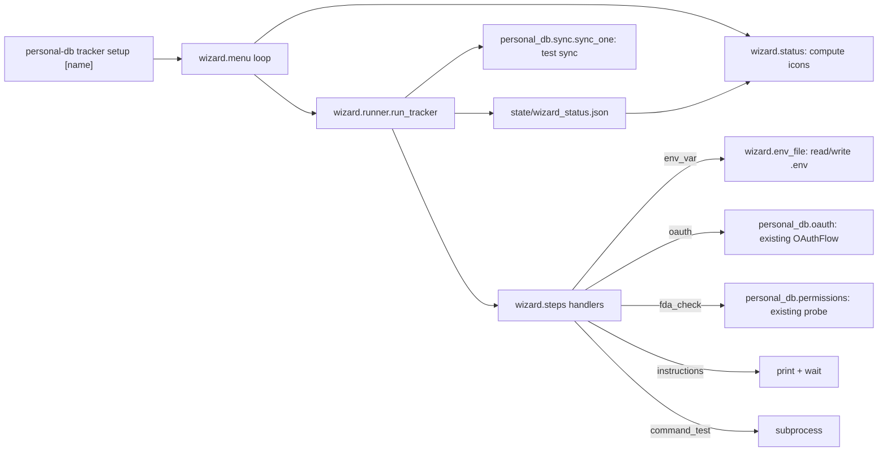

# Tracker Setup Wizard — Design (v0.1)

**Status:** Draft for review
**Date:** 2026-04-26

---

## 1. Problem

v0 ships five connectors but assumes the user can read each manifest's `setup_steps: list[str]` (currently human prose) and execute it manually: export GITHUB_TOKEN, set up Whoop OAuth, grant Full Disk Access to the right terminal binary, edit `entities/people.yaml`. That's enough friction that a real user — even the author — will get one connector working and stall on the others. **Without data flowing, the rest of the system is empty infrastructure.**

The first user signal we have is one row: `habits.shower=1` logged from Claude Code via the MCP `log_event` tool. Logging worked because `habits` has zero setup. Every other connector is gated by manual configuration the user hasn't done.

The wedge for v0.1 is therefore: **collapse the per-connector setup friction to a single guided command**, so all five connectors get configured in one sitting and start producing data.

## 2. Wedge

**Primary v0.1 work:** an interactive setup wizard that walks the user through configuring each installed tracker — env vars, OAuth flows, FDA permissions, supplementary instructions — and verifies each is working with a test sync.

**Explicitly NOT in v0.1** (per the "wizard alone, no daemon" decision in brainstorming):
- The thin daemon (deferred to v0.2; launchd-poll model continues to work for sync cadence).
- Web UI for browsing/logging data (v0.2 territory).
- Per-connector custom Python wizard hooks (defer until a connector demands one).
- Connector authoring UX (`personal-db tracker new --interactive`).
- Cross-platform setup logic (macOS only, matching v0 scope).

## 3. UX

`personal-db tracker setup` opens a navigable list of installed trackers with status icons:

```
Tracker setup
─────────────────────────────────────────────────────
  ✓ github_commits   configured · last test 2 min ago
  ! whoop            configured · test sync failed (401 Unauthorized)
  ✗ screen_time      needs setup (Full Disk Access)
  ✗ imessage         needs setup (Full Disk Access)
  — habits           no setup needed

  ✓ Done — exit wizard
```

- **Navigation:** arrow keys + Enter (questionary `select`).
- **Selecting a tracker** runs that tracker's `setup_steps` in order, then a test sync, then returns to the menu with the icon updated.
- **Selecting "Done"** exits the wizard cleanly.
- **No "skip already set"** behavior — the menu IS the skip mechanism. The user's eyes pick which connector to work on next.
- **Re-selecting an already-configured tracker** re-runs its flow with current values shown as defaults (e.g. `current: ghp_••••5678 — press Enter to keep`).

### Status icons

| Icon | Meaning |
|---|---|
| `✓` | All `setup_steps` pass their cheap "is this configured?" probe AND the most recent recorded test sync succeeded. |
| `!` | All steps pass the cheap probe but the last recorded test sync failed. The error reason renders on the next line. |
| `✗` | At least one required step's prerequisite is missing (env_var not in `.env`, no oauth token, fda_check fails). |
| `—` | The manifest's `setup_steps` is empty (e.g. `habits`). Nothing to do. |

Status is recomputed on each menu redraw (cheap — sub-100ms for 5 trackers).

### Direct one-tracker mode

`personal-db tracker setup <name>` runs that tracker's flow once and exits, without the menu. Useful for re-fixing a single connector or for scripting. No `--all` flag — the no-arg menu form is the multi-tracker flow.

## 4. Architecture



The wizard is a thin orchestrator over existing modules. New code: `wizard/` package + a CLI subcommand. Reuses `personal_db.oauth`, `personal_db.permissions`, and `personal_db.sync` as-is.

## 5. Manifest schema extension

### Today (v0)

```yaml
setup_steps:
  - "Set GITHUB_TOKEN env var with a personal access token (scopes: read:user, repo)"
  - "Set GITHUB_USER env var to your GitHub username"
```

### v0.1

```yaml
setup_steps:
  - type: env_var
    name: GITHUB_TOKEN
    prompt: "Personal access token (scopes: read:user, repo)"
    secret: true
  - type: env_var
    name: GITHUB_USER
    prompt: "Your GitHub username"
```

The `setup_steps` field type changes from `list[str]` to `list[SetupStep]` (a Pydantic discriminated union). Old prose strings are no longer valid; the migration is a one-shot edit per connector (Section 8).

### Step types

```python
# Pseudocode of the discriminated union (real impl uses Pydantic v2 tagged union)
class EnvVarStep(BaseModel):
    type: Literal["env_var"]
    name: str                   # e.g. "GITHUB_TOKEN"
    prompt: str                 # human-readable text
    secret: bool = False        # mask input

class OAuthStep(BaseModel):
    type: Literal["oauth"]
    provider: str               # e.g. "whoop" — matches state/oauth/<provider>.json
    client_id_env: str          # env var holding the client id
    client_secret_env: str      # env var holding the client secret
    auth_url: str
    token_url: str
    scopes: list[str] = []
    redirect_path: str = "/callback"

class FdaCheckStep(BaseModel):
    type: Literal["fda_check"]
    probe_path: str             # path to the gated SQLite file (~ expanded)

class InstructionsStep(BaseModel):
    type: Literal["instructions"]
    text: str                   # markdown-ish prose

class CommandTestStep(BaseModel):
    type: Literal["command_test"]
    command: list[str]          # argv, no shell expansion
    expect_pattern: str | None = None  # regex; if set, stdout must match
    expect_returncode: int = 0

SetupStep = Annotated[
    EnvVarStep | OAuthStep | FdaCheckStep | InstructionsStep | CommandTestStep,
    Field(discriminator="type"),
]
```

`command_test` exists as an escape hatch for verification scenarios none of v0's connectors need but are easy to imagine ("run `op item get --vault ...` to verify the user has 1Password configured").

## 6. Step handlers

All handlers live in `wizard/steps.py` and share the signature:

```python
def handle(step: SetupStep, ctx: WizardContext) -> StepResult: ...
```

`StepResult` is one of `Ok`, `Failed(reason: str)`, `Skipped(reason: str)`. `WizardContext` carries the `Config`, the `<root>/.env` path, and a logger.

| Step type | Handler behavior |
|---|---|
| `env_var` | Read current value from `<root>/.env` (if any). Render `"current: ••••5678 (Enter to keep)"` if present and `secret=True`, else show full current value. Prompt for new value (masked when `secret`); empty input keeps current. On submit, write to `<root>/.env` (preserving comments + ordering). Returns `Ok` if the env var ends up non-empty. |
| `oauth` | Read `client_id_env` and `client_secret_env` from environment (already populated by `dotenv` load); if either missing, prompt for them inline (saving back to `.env`). Spin up `personal_db.oauth.OAuthFlow` on an ephemeral port; print authorize URL with `redirect_uri=http://127.0.0.1:<port>{redirect_path}` and `scope=<space-joined>`; user opens in browser; capture code; POST to `token_url` to exchange; save token via `oauth.save_token(cfg, provider, token)`. Returns `Ok` if `state/oauth/<provider>.json` exists with a valid `access_token` after the flow. |
| `fda_check` | Use `personal_db.permissions.probe_sqlite_access(probe_path)`. If granted, return `Ok`. If denied, print the standard FDA-grant instructions (which terminal binary needs FDA, why), call `permissions.open_fda_settings_pane()`, and prompt: `"Press Enter once granted, or 'q' to skip"`. Re-probe on Enter. Loop up to 3 times before returning `Failed`. |
| `instructions` | Print `step.text` via `rich.print` (so markdown-ish formatting survives). Prompt `"Press Enter when done"`. Always returns `Ok`. |
| `command_test` | `subprocess.run(step.command, capture_output=True, text=True, timeout=30)`. Check returncode == `expect_returncode`. If `expect_pattern`, also check `re.search(pattern, stdout)`. Returns `Ok` or `Failed(stderr or 'pattern mismatch')`. |

After all steps complete (or one returns terminally `Failed`), the runner invokes `sync_one(cfg, name)`. Result + timestamp are persisted to `<root>/state/wizard_status.json` so the menu can render the icon on return.

## 7. `<root>/.env` semantics

- **Path:** `<root>/.env`. Created by the wizard on first `env_var` write. Mode `0600`.
- **Loaded** by both the CLI and the MCP server on startup, via `dotenv.load_dotenv(<root>/.env, override=False)`. `override=False` means real shell env vars still win — useful for debugging and for the test suite's `monkeypatch.setenv`.
- **Read by connectors** via plain `os.environ.get(...)` — no API change to ingest scripts.
- **Launchd plist** already passes `--root <path>`, so scheduled syncs see the same `.env` as interactive ones.
- **Already gitignored** (added in the early code-review-fixes commit).
- **Format:** standard dotenv (`KEY=value`, optional double-quoted strings). Comments preserved on update via the `wizard/env_file.py` module — no library dependency for the writer (~50 LOC).

## 8. Connector manifest migrations

Each of the 5 v0 connectors gets its `setup_steps` rewritten:

### `github_commits`
```yaml
setup_steps:
  - type: env_var
    name: GITHUB_TOKEN
    prompt: "GitHub personal access token (scopes: read:user, repo)"
    secret: true
  - type: env_var
    name: GITHUB_USER
    prompt: "Your GitHub username"
```

### `whoop`
```yaml
setup_steps:
  - type: env_var
    name: WHOOP_CLIENT_ID
    prompt: "Whoop OAuth client ID (from developer.whoop.com)"
  - type: env_var
    name: WHOOP_CLIENT_SECRET
    prompt: "Whoop OAuth client secret"
    secret: true
  - type: oauth
    provider: whoop
    client_id_env: WHOOP_CLIENT_ID
    client_secret_env: WHOOP_CLIENT_SECRET
    auth_url: "https://api.prod.whoop.com/oauth/oauth2/auth"
    token_url: "https://api.prod.whoop.com/oauth/oauth2/token"
    scopes: ["read:profile", "read:cycles"]
```

### `screen_time`
```yaml
setup_steps:
  - type: fda_check
    probe_path: "~/Library/Application Support/Knowledge/knowledgeC.db"
```

### `imessage`
```yaml
setup_steps:
  - type: fda_check
    probe_path: "~/Library/Messages/chat.db"
  - type: instructions
    text: |
      Add aliases for known people in `<root>/entities/people.yaml`, e.g.:

        - display_name: Marko
          aliases: ["marko@example.com", "+15551234567"]

      Aliases let messages from emails/phones resolve to a single person_id
      across all trackers. Without aliases, every handle becomes its own
      auto-created person.
```

### `habits`
```yaml
setup_steps: []  # nothing to configure
```

`personal_db.manifest.Manifest`'s `setup_steps` field type changes from `list[str]` to `list[SetupStep]`. Two existing call sites consume it (`tracker_cmd.list_cmd`, `mcp_server.tools.describe_tracker`) — both just pass the list through without parsing prose. **Behavior change for MCP clients:** `describe_tracker`'s `setup_steps` field shape changes from a list of strings to a list of structured objects. This is a v0→v0.1 schema break for any MCP client that introspected this field. Acceptable for v0.1 since no external client depends on it yet.

## 9. CLI surface

- `personal-db tracker setup` (no arg) — opens the menu. **Primary entry point.**
- `personal-db tracker setup <name>` (arg) — runs that tracker's flow once and exits, no menu.
- `personal-db tracker list` — unchanged. Continues to print the `personal_db.manifest.Manifest.description` field (which the wizard doesn't touch).

That's the entire CLI surface change. No `--all`, no `--non-interactive`, no flags.

## 10. File layout

```
src/personal_db/
  wizard/
    __init__.py
    schema.py        # Pydantic SetupStep types + discriminated union
    steps.py         # one handler per step type
    status.py        # compute ✓/!/✗/— per tracker
    env_file.py      # read/write/update <root>/.env preserving comments
    menu.py          # the questionary loop
    runner.py        # run_tracker(name): execute steps + test sync + persist status
  cli/
    tracker_cmd.py   # MODIFIED: add `setup` subcommand wired to wizard.menu / wizard.runner
  manifest.py        # MODIFIED: setup_steps field changes from list[str] to list[SetupStep]

tests/
  unit/
    test_wizard_schema.py     # discriminated union parsing, validation errors
    test_wizard_steps.py      # each handler against fakes
    test_wizard_status.py     # icon computation
    test_env_file.py          # roundtrip read/write/update
  integration/
    test_cli_setup.py         # `personal-db tracker setup <name>` happy path with mocked input
```

## 11. Component boundaries

| Unit | Owns | Talks to | Does not own |
|---|---|---|---|
| `wizard.schema` | `SetupStep` discriminated union, validation | Pydantic | Step execution |
| `wizard.steps` | One handler per step type, `StepResult`, `WizardContext` | `oauth`, `permissions`, `env_file`, questionary | Step ordering, status persistence |
| `wizard.env_file` | Read/write/update `<root>/.env` preserving comments | filesystem | dotenv loading (that's the framework's job at CLI startup) |
| `wizard.status` | Compute per-tracker icon by combining cheap probes + last-test-sync result | `manifest`, `oauth`, `permissions`, `state/wizard_status.json` | Running anything |
| `wizard.menu` | The questionary loop, dispatch on selection | questionary, `wizard.runner`, `wizard.status` | Step logic |
| `wizard.runner` | `run_tracker(name)`: execute `setup_steps` in order + test sync + persist status | `wizard.steps`, `sync.sync_one`, `state/wizard_status.json` | Menu rendering |
| `cli.tracker_cmd.setup` | CLI argument parsing for `setup [name]`; dispatch to menu or runner | `wizard.menu`, `wizard.runner` | Step logic |

Each file should stay under ~250 LOC. The `wizard/` package as a whole is roughly 600-800 LOC including handlers; if any single file grows past that, split.

## 12. Error handling

- **Step failures are non-fatal at the menu level.** A `Failed` step ends that tracker's flow, persists the failure reason to `state/wizard_status.json`, and returns to the menu with the `!` icon. The user can re-select to retry.
- **Test sync failures are non-fatal at the menu level.** Same path: failure reason recorded, `!` icon on return.
- **Manifest validation errors** at startup (e.g. malformed `setup_steps`) abort the wizard and print the offending file path and Pydantic error trace.
- **`.env` read errors** (file exists but malformed) abort with a "fix or delete `<root>/.env`" message. Atomic write on update (write tmp + rename) so partial-write corruption is impossible.
- **OAuth flow timeouts** (no callback within 120s) print "OAuth timeout — did you complete the redirect?" and return `Failed`. The user can retry by re-selecting.
- **FDA grant timeouts** (3 retry loops without success) return `Failed` with a "grant FDA to your terminal binary, restart this terminal, then retry" message.
- **questionary keyboard interrupt** (Ctrl-C) exits cleanly without persisting partial state.

## 13. Testing

- **`test_wizard_schema.py`** — round-trip valid manifests; assert discriminated union picks the right subclass; assert validation errors on missing required fields, unknown `type`, prose strings (the v0 format).
- **`test_wizard_steps.py`** — each handler with fakes:
  - `env_var`: against an in-memory `.env` (tmp_path), assert masked-input prompt + value persistence.
  - `oauth`: mock `OAuthFlow` to immediately return a fake code; mock `requests.post` for the token exchange; assert token saved.
  - `fda_check`: against a tmp SQLite file (granted) and a chmod-000 file (denied); assert retry loop after simulated grant.
  - `instructions`: assert prints + always returns `Ok`.
  - `command_test`: against `true` (Ok), `false` (Failed), and `echo "match"` with `expect_pattern="ma.ch"` (Ok).
- **`test_wizard_status.py`** — synthesize tmp_root states (.env contents × oauth tokens × wizard_status.json); assert icons.
- **`test_env_file.py`** — roundtrip read/write/update preserving comments + ordering; atomic-write semantics.
- **`test_cli_setup.py`** — `personal-db tracker setup <name>` with `monkeypatch.setattr(questionary, "text", FakePrompt(...))`. Verify `.env` is written and `sync_one` is called. The questionary `select` menu loop is NOT integration-tested — questionary's interactive event loop is hard to drive cleanly from pytest. Test the menu's component functions (status, render, dispatch) and accept manual smoke for the loop itself.
- **No live API tests in CI.** OAuth uses a mocked token endpoint; FDA uses synthetic SQLite files.

## 14. Dependencies

- **New top-level:** `questionary>=2.0`.
- **Promote to top-level:** `python-dotenv>=1.0` (currently transitive via `mcp`).
- **No removals.**

## 15. Success criteria

> *"`personal-db tracker setup` walks me through configuring all 5 connectors in under 10 minutes. After it exits, all 5 are syncing successfully — I can see real GitHub commits, Whoop cycles, screen time, iMessages in `db.sqlite`, and Claude can query them via MCP without me having to debug anything."*

Concretely:

1. The wizard's menu renders, statuses correctly, and exits cleanly on "Done".
2. Each of the 5 step types has a working handler verified by unit tests against fakes.
3. The 5 v0 connector manifests are migrated to the new `setup_steps` schema.
4. After running the wizard end-to-end manually on the author's machine: `.env` exists with GITHUB_TOKEN/GITHUB_USER/WHOOP_CLIENT_ID/WHOOP_CLIENT_SECRET, `state/oauth/whoop.json` exists with a valid token, `personal-db permission check screen_time` and `imessage` both report granted, and `personal-db sync github_commits whoop screen_time imessage` all succeed with row counts > 0.
5. Re-running the wizard shows all `✓` icons and re-selecting any tracker shows current values as defaults (Enter-to-keep behavior).

## 16. Open questions deferred to implementation plan

- Exact `env_file` write algorithm (parse-edit-rewrite vs. append-only with dedup).
- Whether `wizard_status.json` should be one file per tracker or a single combined file (combined is simpler; one file is more parallel-safe — irrelevant for v0.1's single-process wizard).
- Whether to show step-by-step progress within a single tracker's flow (e.g. "[1/3] env_var GITHUB_TOKEN... done") or just print final status. Recommendation: show step-by-step; trivial to implement with `rich.console`.
- Exact OAuth `authorize URL` construction — probably `urllib.parse.urlencode` with `state` (random nonce), `client_id`, `redirect_uri`, `response_type=code`, `scope`. Spec the exact param shape in the plan.
- The existing `personal_db.oauth` module has `OAuthFlow` (callback server), `save_token`, `load_token`, and `refresh_if_needed`, but no helper for the initial *code-for-token* exchange (the v0 OAuth path is refresh-only since tokens were assumed pre-existing). The wizard's `oauth` step handler needs this exchange. Recommendation: add `oauth.exchange_code(token_url, client_id, client_secret, code, redirect_uri) -> dict` to the module for symmetry with `refresh_if_needed`, rather than inline `requests.post` in the handler.

These are concrete enough to defer to the writing-plans step.

---

*End of design.*
